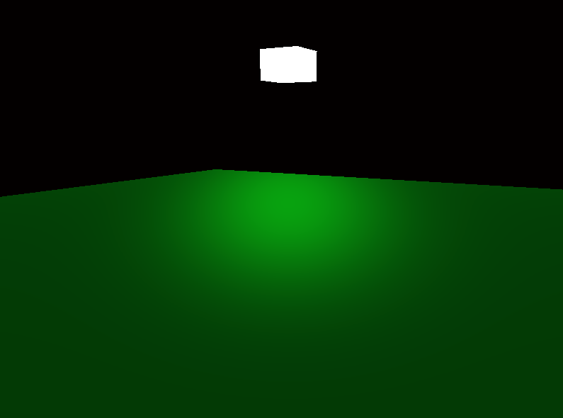
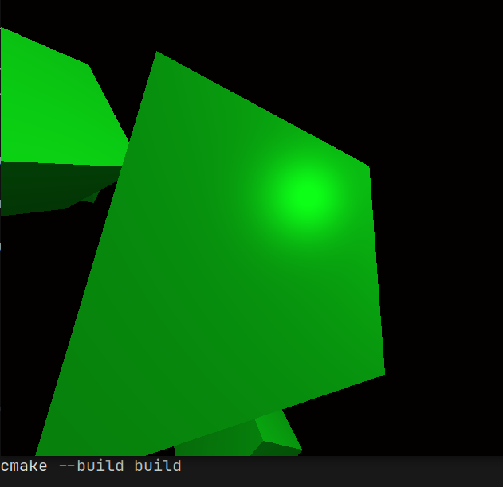

# OpenGLRender

OpenGL renderer project built while following LearnOpenGL.
(WIP)
## Dependencies

### Arch Linux

```bash
sudo pacman -S cmake gcc glfw glm
```

## Build

```bash
Clone this Repo
cd OpenGLRender

cmake -B build
cmake --build build
```

## Run

```bash
./build/glprojects
```

## Controls

| Key          | Action        |
| ------------ | ------------- |
| W / ↑        | Move Forward  |
| S / ↓        | Move Backward |
| A / ←        | Move Left     |
| D / →        | Move Right    |
| Mouse        | Look Around   |
| Scroll Wheel | Zoom          |
| ESC          | Exit          |

## Progress

* [x] Getting Started
* [x] Textures
* [x] Coordinate Systems
* [x] Camera
* [x] Colors
* [x] Basic Lighting
* [ ] Materials
* [ ] Lighting Maps
* [ ] Light Casters
* [ ] Multiple Lights
* [ ] Model Loading
* [ ] Advanced OpenGL

## Phong Lighting

### Screenshot 1



### Screenshot 2



## Built With

* OpenGL
* GLFW
* GLM
* CMake
* GCC
* Arch Linux

## References

* https://learnopengl.com/
